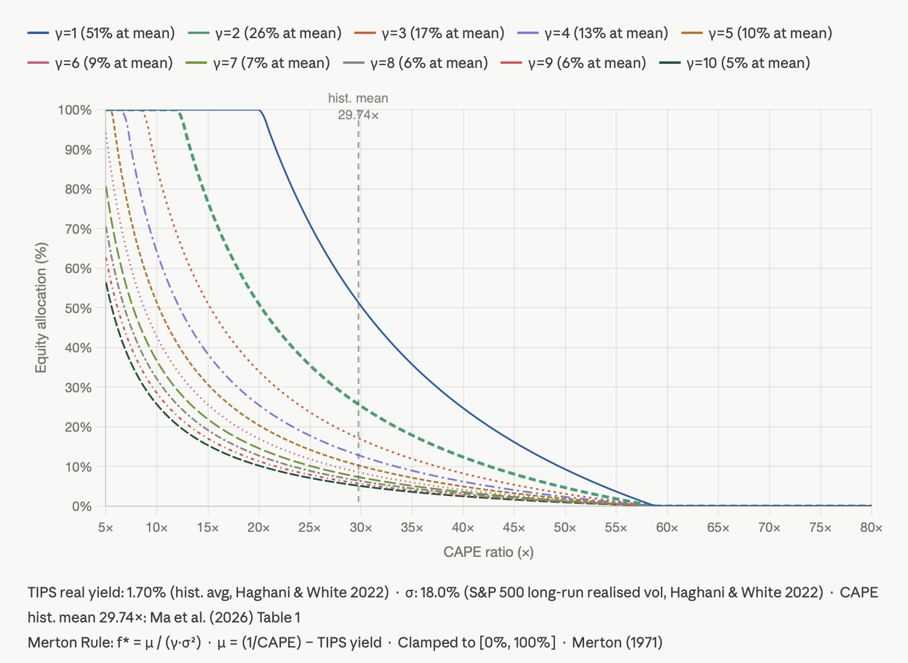

# Component CAPE + Merton Rule Portfolio Allocator

I became interested in optimal equity allocation after reading Shiller's Irrational Exuberance and tracking his CAPE ratio during the high equity valuations in 2025 with the AI bubble and global tariffs.

[This FTAV article](https://www.ft.com/content/84b8a579-8634-47de-a421-a1eb39c8577d) by Toby Nangle pointed me to Ma, Marshall, Nguyen & Visaltanachoti (2026), who proposed the component CAPE as a new model that provides higher accuracy for returns prediction.

I thought it would be fun to test this out using the Merton Rule framework proposed by [Haghani & White (2022)](https://elmwealth.com/earnings-yield-dynamic-allocation/), using the excess yield over the TIPS rate to establish the equity risk premium.

**Merton Rule:**

$$f^* = \frac{\mu}{\gamma \cdot \sigma^2}$$

where:

- $\mu$ = Excess Earnings Yield = $\frac{1}{\text{CAPE}} - \text{TIPS yield}$
- $\gamma$ = risk aversion
- $\sigma$ = equity volatility

## Model Visualisation



_Chart created via Claude to visualise the model, not a live part of the allocator output._

## Installation

```bash
# Create and activate virtual environment (or use venv, conda, etc.)
uv venv && source .venv/bin/activate

# Install dependencies (core only for basic usage)
uv pip install -e "."

# OR install with development tools
uv pip install -e ".[dev]"

# Copy environment file
cp .env.example .env   # add your FRED API key
```

## Usage

```bash
cape-allocator # interactive
cape-allocator --gamma 2.0 --sigma 0.18 --cape-variant component_10y
cape-allocator --cape 56.0 --tips 0.022  # m2qanual override, no API needed
```

- `--gamma` is the most consequential choice. `γ = 2` (Haghani & White default) is aggressive; `γ = 5` (Ma et al. calibration) allocates ~30% at the historical mean CAPE.
- `--cape` and `--tips` together set where on the x-axis the program is operating
- `--sigma` can generally be left at the default 18%, which is the long-run historical average

`cape-allocator --help` For more options

### Choosing γ (risk aversion)

A standard heuristic is to ask: _how would a permanent 50% loss of wealth affect my life?_

| γ   | Profile                                                                   |
| --- | ------------------------------------------------------------------------- |
| 1   | Young investor, long horizon, stable income; near-maximally aggressive    |
| 2   | Haghani & White (2022) default; moderate risk tolerance                   |
| 5   | Ma et al. (2026) calibration; pre-retiree or institutionally conservative |
| 10  | Retiree; portfolio is primary income source                               |

Note that `γ` should reflect _financial_ risk aversion rather than emotional comfort. A large pension or guaranteed income effectively lowers your financial `γ` even if markets make you nervous. See [Haghani & White (2018)](https://elmwealth.com/measuring-the-fabric-of-felicity/)

### Choosing equity bounds

Of course this model goes against the prevailing advice for savers to always maintain a baseline level of equities, and avoid the sin of timing the market. We can build this advice into the model by adjusting the equity bounds accordingly.

It is common to see 60/40 as a default allocation, which we could apply with the params `--min_equity .4 --max_equity .6`, the range dependant on how far we can tolerate departing from the baseline.

A young investor may expect at least 50% equities and so would apply `--min_equity .5`.

## Data sources

Responses are cached under `CAPE_CACHE_DIR` (default `~/.cache/cape_allocator`).

- **FRED** ([API key](https://fred.stlouisfed.org/docs/api/api_key.html) in `.env`): TIPS `DFII10` / `WFII10`, CPI `CPIAUCSL`.
- **[Wikipedia](https://en.wikipedia.org/wiki/List_of_S%26P_500_companies)**: S&P 500 tickers.
- **[Yahoo Finance](https://finance.yahoo.com/)** via [yfinance](https://github.com/ranaroussi/yfinance): prices, market cap, EPS (unofficial).
- **[Shiller CAPE spreadsheet](http://www.econ.yale.edu/~shiller/data/ie_data.xls)** (Yale): aggregate CAPE and low-coverage fallback.

`--cape` and `--tips` together skip live CAPE/TIPS fetches.
Adjust CLI fetch logs: `-v` (verbose) / `-q` (quiet).

## Development

### Type Checking

This project uses [ty](https://docs.astral.sh/ty/) for type checking.

```bash
# Run type checks
ty check

# Run with specific configuration
ty check --config pyproject.toml
```

### Linting

This project uses [Ruff](https://docs.astral.sh/ruff/) for code linting and formatting.

```bash
# Check for linting issues
ruff check .

# Fix auto-fixable issues
ruff check . --fix

# Format code
ruff format .
```

### Testing

Run the test suite using pytest:

```bash
# Run all tests
pytest

# Run with coverage report
pytest --cov=cape_allocator --cov-report=html
```

### Continuous Integration

This project uses GitHub Actions for automated testing, linting, and type checking. Workflows are defined in `.github/workflows/ci.yml` and run on:

- Push to `main` branch
- Pull requests to `main` branch

The CI pipeline checks:

- **Lint**: Code style and quality with Ruff
- **Type Check**: Type safety with ty
- **Test**: Unit tests with pytest and coverage reporting

## References

- Haghani, V., & White, J. (2018) "Measuring the Fabric of Felicity." Elm Wealth.
  - <https://elmwealth.com/measuring-the-fabric-of-felicity/>

- Haghani, V., & White, J. (2022). "Man Doth Not Invest by Earnings Yield Alone: A Fresh Look at Earnings Yield and Dynamic Asset Allocation." Elm Wealth.
  - <https://elmwealth.com/earnings-yield-dynamic-allocation/>

- Li, K., Li, Y., Lyu, C., & Yu, J. (2025). "How to Dominate the Historical Average." _Review of Financial Studies_.
  - <https://academic.oup.com/rfs/article/38/10/3086/8010588>

- Ma, Q., Marshall, A., Nguyen, T. H., & Visaltanachoti, N. (2026). Component CAPE research.
  - <https://papers.ssrn.com/sol3/papers.cfm?abstract_id=6060895>
